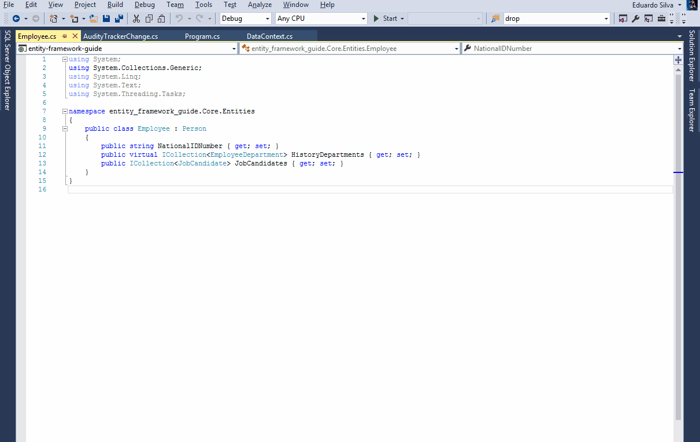
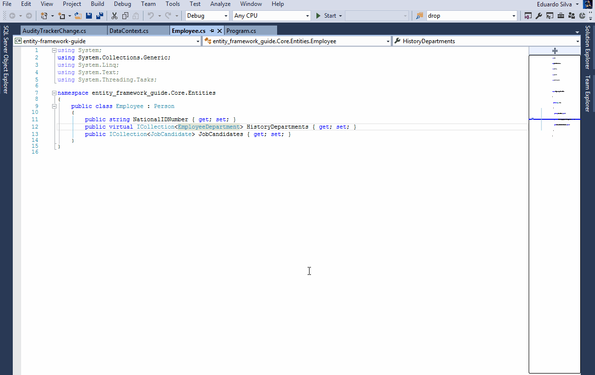

# Visual Studio Power User

## Introduction

This is a simples and objective guide to nice Visual Studio features.

## Enable scroll map mode

## Peek code definition

> You can use the shortcut ALT + F12

## Shortcut to show Solution Explorer

> `CLTRL + ALT + L`

## Shortcut to collapse all folter in the Solution Explorer

> `CLTRL + ALT + A` (necessário configurar o keyboard shortcut para o ProjectAndSolutionContextMenu)