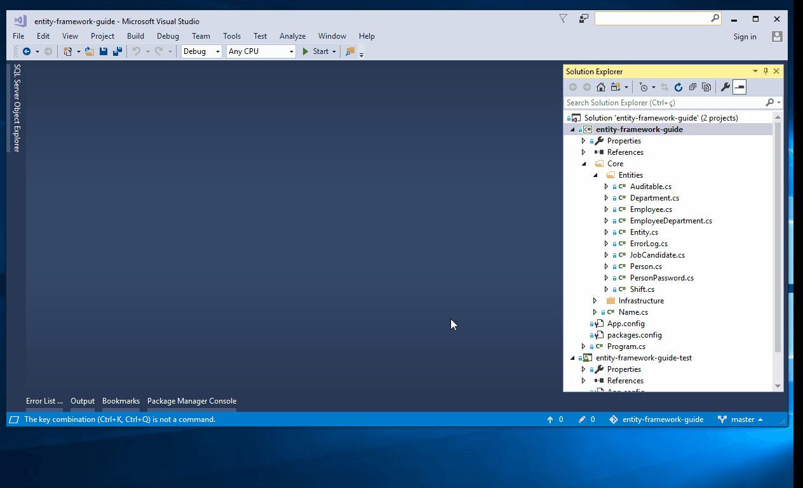
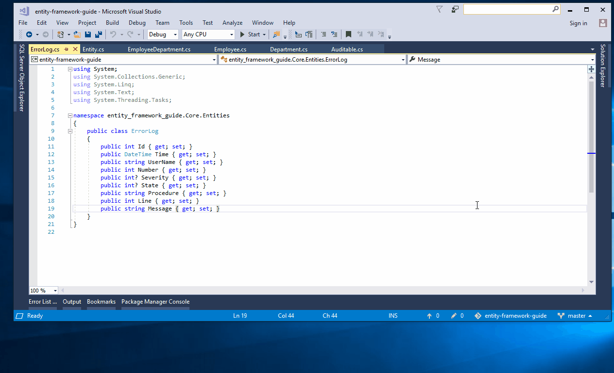

# Visual Studio Power User

## Introduction

This is a simples and objective guide to nice Visual Studio features.

## Enable scroll map mode

## Peek code definition

> You can use the shortcut ALT + F12

## Shortcut to show Solution Explorer

> `CLTRL + ALT + L`

## Shortcut to collapse all folter in the Solution Explorer

> `CLTRL + ALT + A` 
>

## Shortcut to open Source Control Explorer - Only available to TFS Source Control

> `CLTRL + SHIT + S + C` 
>
> Shortcut to View.TfsSourceControlExploer

## Shortcut to close all

> `CLTRL + SHIT + F4`
>
> Shortcut to Window.CloseAllDocuments

